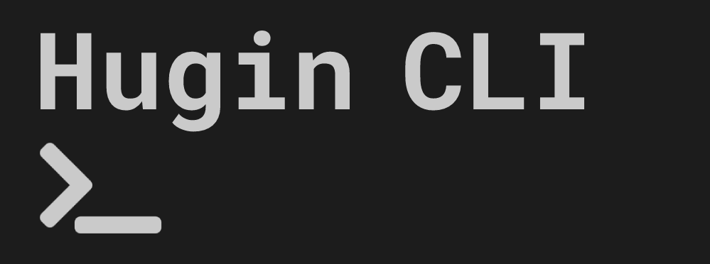

Hugin CLI - A Hugin Messenger client built with C++17. 

# Table of Contents

- [Development Resources](#development-resources)
- [Setup and run](#setup-and-run)
    - [Commands](#commands)
    - [Clean](#clean)
- [Testing](#testing)
    - [Unit Testing](#unit-testing)
- [Contribute](#contribute)
    - [Pull request](#pull-request)
- [Contributors](#contributors)
- [License](#license)

# Development Resources

- Web: https://kryptokrona.org
- Docs: https://docs.kryptokrona.org
- Mail: mjovanc@icloud.com
- GitHub: https://github.com/mjovanc/hugin-cli
- Hugin: hugincli board on Hugin Messenger (currently only GUI version). It is HIGHLY recommended to join our board on Hugin Messenger if you want to contribute to stay up to date on what is happening on the project.
- Twitter: @mjovanc

# Setup and run

1. Clone the repository
2. Run `cmake .` to initialize CMake project
3. Run `cmake -B ./build -S .`
4. Go to build directory and run `make`
5. Run executable `./Hugin`

## Commands

- /register (you will be prompted to enter more information)
- /login (you will be prompted to enter password)
- /join <board name>
- /pm <wallet address here>
- /pgm <group key>

## Clean 

If we want to do a cleanup of generated files during build we can run:

`git clean -xfd`

# Testing 

## Unit testing

To run the test cases in **daemon_test.cpp** that comes along we need (after we have built) to run:

`./build/daemon_test`

We need in the future to link all test files so we can run all unit tests at once.

# Contribute

## Pull request

We appreciate all contributions whether it be small changes such as documentation of source code to major improvement of code. The easiest way is to make a fork and then make a pull request into our master branch. 

# Contributors

The following contributors have either helped to start this project, have contributed
code, are actively maintaining it (including documentation), or in other ways
being awesome contributors to this project. **We'd like to take a moment to recognize them.**

# License

The license is GPL-3.0 License.
