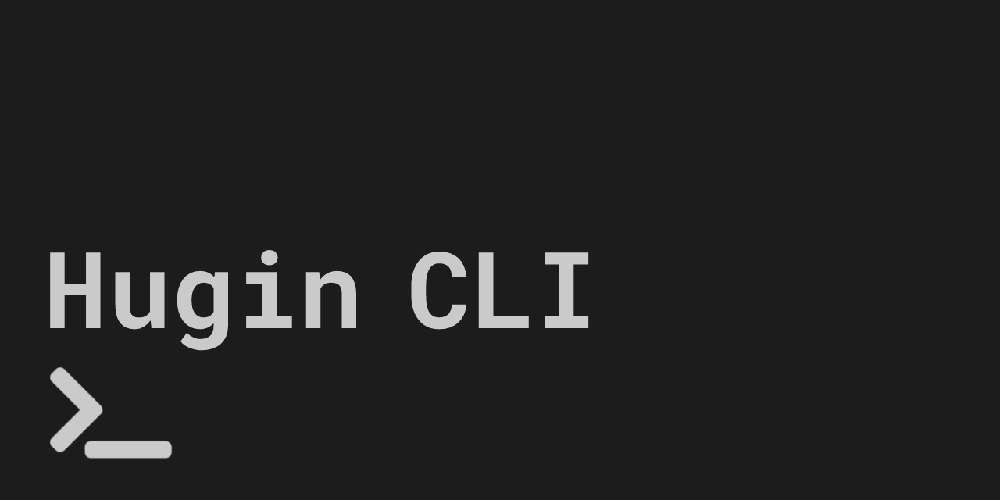

# 

A private messaging CLI based Hugin Messenger. Powered by the Kryptokrona Blockchain.

# Table of Contents

- [Development Resources](#development-resources)
- [Releases](#releases)
- [Setup and run](#setup-and-run)
  - [Dependencies](#dependencies)
  - [Commands](#commands)
  - [Clean](#clean)
- [Testing](#testing)
  - [Unit testing](#unit-testing)
- [CI/CD](#cicd)
- [Screenshots](#screenshots)
- [Contribute](#contribute)
  - [Pull request](#pull-request)
- [Contributors](#contributors)
- [License](#license)

# Development Resources

- Web: https://kryptokrona.org
- Docs: https://docs.kryptokrona.org
- GitHub: https://github.com/kryptokrona/hugin-cli
- Hugin: hugin group on Hugin Messenger (currently only GUI version): `20b4821b90b2ea7355cb7ed7fa60823016eedef0e3541376888f8adc55df75f8` \
  It is HIGHLY recommended to join our board on Hugin Messenger if you want to contribute to stay up to date on what is happening on the project.
- Twitter: @mjovanc

# Releases

| NAME | VERSION                                                            | RELEASED | DESCRIPTION    |
|------|--------------------------------------------------------------------|----------|----------------|
| Tor  | 0.1.0 | No       | Alpha release. |

# Setup and run

1. Clone the repository
2. Run `cmake .` to initialize CMake project
3. Run `cmake -B ./build -S .`
4. Go to build directory and run `make`
5. Run executable `./Hugin`

## Dependencies

The following table summarizes the tools and libraries required to build.

| Dep     | Min. version | Optional | Purpose |
|---------|--------------|----------|---------|
| GCC     | 11           | YES      |         |
| MSVC    | 2019         | YES      |         |
| Clang   | 14           | YES      |         |
| CMake   | 3.18         | NO       |         |
| OpenSSL | -            | NO       |         |

## Commands

### Auth
- `/r` - Register an account.
- `/l` - Login
- `/q` - Quit and logout.

### Chat

- `/b` or `/b <board-name>` - Join a board or list currently joined boards.
- `/pm` or `/pm <hugin-address>` (not implemented) - Join a private message or list currently joined private messages.
- `/pgm` or `/pgm <group-key>` (not implemented) - Join a private group or list currently joined private groups.

### Other
- `/i` (not implemented) - Get regular information such as wallet address, Hugin address, key, current node, node status, funds ratio, balance and so forth.
- `/t` or `/tip <wallet-address|saved-username>` (not implemented) - Tip an amount to a user by wallet address or saved username.
- `/c` or `/c <wallet-address|hugin-address|key|mnemonic-seed|private-keys>` (not implemented) - Copy wallet address, Hugin address, key, mnemonic seed or private keys. Need to authenticate again to access it. If only `/c` it copies everything to clipboard.
- `/s` (not implemented) - Settings to change which node to connect to, username, new password, check for updates and so forth.
- `/lt` (not implemented) - List all transactions made.
- `/lc` (not implemented) - List all contacts with their Hugin addresses and username.
- `/sf <path> <hugin-address|saved-username>` (not implemented) - Send file.

## Clean

If we want to do a cleanup of generated files during build we can run:

`git clean -xfd`

# Testing

## Unit testing

To run the test cases in **daemon_test.cpp** that comes along we need (after we have built) to run:

`./build/daemon_test`

We need in the future to link all test files so we can run all unit tests at once.

# CI/CD

This project is automatically built, tested and deployed using GitHub Actions. We have two pipelines:

- **Main Pipeline** - This is the pipeline that runs the code merged into our master branch.
- **Pull Request Pipeline** - This is the pipeline that runs each time a pull request come in so the reviewer has some
  help evaluating if the code is good enough to be merged.

The Main Pipeline do everything the Pull Request Pipeline does in addition to building and publishing a Docker Image to
the project tagged by the project name, owner, repository and short form of commit SHA value. We also setup continuous
deployment so if all the steps succeed it will upload a new Docker image to GitHub Packages.

# Contribute

## Pull request

We appreciate all contributions whether it be small changes such as documentation of source code to major improvement of
code. The easiest way is to make a fork and then make a pull request into our master branch.

# Contributors

The following contributors have either helped to start this project, have contributed
code, are actively maintaining it (including documentation), or in other ways
being awesome contributors to this project. **We'd like to take a moment to recognize them.**

# License

The license is BSD-3 License.
